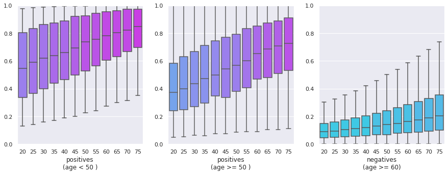
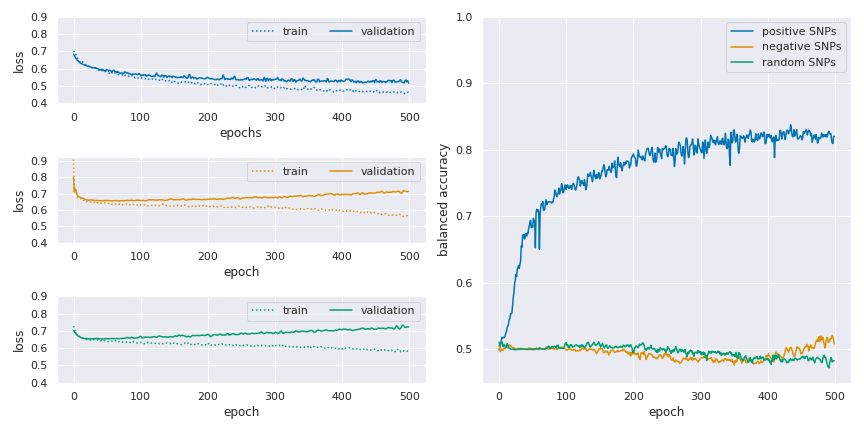

## Diabnet

Este projeto surgiu a partir colaboração com o pesquisador Márcio?, do laboratório do Dr ???. Através deles obtivemos um dataset com 2344 pacientes dos quais 541 apresentam diabetes tipo 2. Além do diagnóstico (_label_) e de características como sexo, idade e diagnóstico dos pais (nem sempre disponível), recebemos 3 conjuntos de 1000 [SNPs](https://pt.wikipedia.org/wiki/Polimorfismo_de_nucleot%C3%ADdeo_%C3%BAnico) cada. Esses 3 conjuntos foram selecionados pelo Márcio de acordo com a correlação dos SNPs em relação ao diagnóstico e são:

1. conjunto de SNPs correlacionados
2. conjunto de SNPs não correlacionados
3. conjunto de SNPs selecionados aleatóriamente

Uma propriedade intessante desses dados é que uma parte dos pacientes possui vários diagnósticos em intervalos de 5 anos. Por exemplo, diagnósticos aos 30, 35 e 40 anos. Isso permite determinar aproximadamente qual a idade a doença se desenvolveu.

### Objetivo

Na posse desses dados, nosso objetivo foi construir um modelo capaz de predizer qual o risco de um paciente desenvolver diabetes tipo 2 ao longo da vida. 

Na prática, o modelo tem como entrada um conjunto determinado de SNPs do paciente, sua idade, sexo e o diagnóstico dos pais (este último, quando estiver disponível). O resultado do modelo são distribuições de probabilidades do indivíduo desenvolver diabetes tipo 2 ao longo de várias faixas etárias. Esses resultados podem então ser comparados com outros pacientes, por exemplo, com pessoas com mais de 60 anos que não desenvolveram diabetes (**negativos**) ou com jovens diabéticos para assim estimar qual o risco relativo do paciente.

### Resultados

#### Distribuição de probabilidades

No conjunto de teste, X pacientes desenvolveram diabetes antes dos 50 anos e Y pacientes depois dos 50 anos. Essa informação pode ser obtida devido às múltiplos diagnósticos que os pacientes foram submetidos ao longo do tempo. A predição para esses dois grupos de pacientes resulta, como esperado, em probabilidades mais altas para o primeiro grupo. Além disso, é possível notar uma uma grande diferença na predição para os grupos em relação a predição para indivíduos com mais de 60 anos e que até o momento não haviam sido diagnosticados com diabetes. 

#### Treinamento das redes neurais artificiais

O treinamento das redes utilizando cada um dos três conjuntos de SNPs demonstrou características interessantes que acreditamos ser uma consequência dos métodos de regularização empregados. Pelo gráfico abaixo podemos notar que os modelos treinados tanto com o conjunto de SNPs aleatórios quanto o de SNPs não correlacionados não conseguem um ajuste equivalente ao modelo treinado com o conjunto de SNPs correlacionados. Esse efeito é ainda mais evidente quando comparamos a acurácia balanceada obtida nas validações, a qual atinge $~0.8$ para o conjunto de SNPs correlacionados enquanto permanece próxima a $0.5$ (acurácia esperada para um modelo aleatório, sem capacidade de predição).

#### Teste do modelo

#### Teste do modelo excluindo pacientes jovens negativos

Outros resultados:

- Avaliação da predição para famílias
- Avaliação da predição por núcleos familiares (grupos de pais + filhos)
- Importância dos atributos na predição.

### Métodos

O modelo escolhido foi uma rede neural artificial _feed-forward_. Nela, a primeira camada é composta por neurônios localmente conectados (_locally connected layer_) que transforma o input em um vetor  $x$ de valores reais, sendo um valor para cada atributo. Logo o vetor tem dimensão igual ao número de atributos (_features_). A segunda camada é uma _fully connected_ com 256 neurônios e função de ativação _Softplus_.E a camada de saída possui um neurônio com função de ativação sigmóide.

Dois métodos de regularização foram utilizados. Na primeira camada utilizamos uma combinação de $l_1$ e $l_2$ no estilo da ElasticNet. A intenção dessa regularização é forçar o valor dos atributos para zero, reduzindo a influência dos menos significantes para o modelo. Na segunda camada utilizamos um dropout com p=0.5. Esse dropout tem duplo objetivo: durante o treinamento ele atua como um regularizador, no entanto ele permanece ativo durante a inferência para aplicação do método de MC Dropout como proposto por Gal. Com esse método, múltiplas inferências para o mesmo input produzem uma distribuição de probabilidades o que nos permite avaliar a incerteza do modelo.
